*This project has been created as part of the 42 curriculum by [mcolin](https://profile-v3.intra.42.fr/users/mcolin), [ykolacze](https://profile-v3.intra.42.fr/users/ykolacze).*

# PROJECT [42](https://42.fr/en/homepage/) : Minishell >_

This project will allow you to explore the shell, or command language interpreter, for the GNU operating system, [Bourne Again Shell, more commonly known as bash](https://en.wikipedia.org/wiki/Bash_(Unix_shell)).

## 📖 Description [**Minishell**](https://cdn.intra.42.fr/pdf/pdf/196103/en.subject.pdf)

The Minishell project consists of recreating a mini command interpreter (shell) in C, similar to bash, but with a limited and specific set of features. It is a core project of the common curriculum, as it combines parsing, process management, signals, and memory.

## 🧠 what we have learned

- Undertsand the mechanics of [bash](https://www.gnu.org/software/bash/manual/bash.html).

- How to execute a binary from our own program and make multiple executables communicate with each other

- Understand signals, and how to handle them with the launch of another executable

- Understand the use of environment

## 📜 None of this would have been possible without you. Thank you.

[eblondee](https://profile-v3.intra.42.fr/users/eblondee): 👑 Thank you for all the hours spent teaching us `strace`! 🧦

[ehode](https://profile-v3.intra.42.fr/users/ehode): 🐐 Thank you for destroying our minishell multiple times! 👁️

[rgramati](https://profile-v3.intra.42.fr/users/rgramati): 🗿 Thanks for ALL, literally! 🥖

## 🌳 Tree

<details>
<summary><h2>show</h2></summary>

```txt
.
|-- Makefile
|-- README.md
|-- includes
|   |-- built_in.h
|   |-- ctx.h
|   |-- execute.h
|   |-- here_doc.h
|   |-- minishell.h
|   |-- parse.h
|   |-- sig.h
|   `-- utils.h
|-- libft
|   |-- Makefile
|   |-- includes
|   |   `-- libft.h
|   `-- srcs
|       |-- ft_atoi.c
|       |-- ft_bzero.c
|       |-- ft_calloc.c
|       |-- ft_free_double.c
|       |-- ft_isalnum.c
|       |-- ft_isalpha.c
|       |-- ft_isascii.c
|       |-- ft_isdigit.c
|       |-- ft_isprint.c
|       |-- ft_itoa.c
|       |-- ft_lstadd_back.c
|       |-- ft_lstadd_front.c
|       |-- ft_lstclear.c
|       |-- ft_lstdelone.c
|       |-- ft_lstiter.c
|       |-- ft_lstlast.c
|       |-- ft_lstmap.c
|       |-- ft_lstnew.c
|       |-- ft_lstsize.c
|       |-- ft_memchr.c
|       |-- ft_memcmp.c
|       |-- ft_memcpy.c
|       |-- ft_memmove.c
|       |-- ft_memset.c
|       |-- ft_putchar_fd.c
|       |-- ft_putendl_fd.c
|       |-- ft_putnbr_fd.c
|       |-- ft_putstr_fd.c
|       |-- ft_split.c
|       |-- ft_strchr.c
|       |-- ft_strcmp.c
|       |-- ft_strdup.c
|       |-- ft_striteri.c
|       |-- ft_strjoin.c
|       |-- ft_strlcat.c
|       |-- ft_strlcpy.c
|       |-- ft_strlen.c
|       |-- ft_strmapi.c
|       |-- ft_strncmp.c
|       |-- ft_strnlen.c
|       |-- ft_strnstr.c
|       |-- ft_strrchr.c
|       |-- ft_strtrim.c
|       |-- ft_substr.c
|       |-- ft_tolower.c
|       |-- ft_toupper.c
|       `-- get_next_line.c
|-- srcs
|   |-- built_in
|   |   |-- cd
|   |   |   |-- cd.c
|   |   |   |-- cd_utils.c
|   |   |   `-- cd_utils2.c
|   |   |-- echo.c
|   |   |-- env.c
|   |   |-- exit
|   |   |   |-- exit.c
|   |   |   `-- exit_utils.c
|   |   |-- export
|   |   |   |-- export.c
|   |   |   `-- export_parse.c
|   |   `-- pwd.c
|   |-- ctx
|   |   |-- ctx_destroy.c
|   |   |-- ctx_init.c
|   |   |-- declare_x.c
|   |   `-- env_init_default.c
|   |-- execute
|   |   |-- cmd_to_arg.c
|   |   |-- execute.c
|   |   |-- execute_built_in.c
|   |   |-- execute_chunk.c
|   |   |-- execute_cmd.c
|   |   |-- forgotten_child.c
|   |   `-- manage_redir.c
|   |-- here_doc
|   |   |-- get_here_doc.c
|   |   |-- here_doc.c
|   |   `-- parse_limiter.c
|   |-- minishell.c
|   |-- parse
|   |   |-- expand.c
|   |   |-- get_next_token.c
|   |   |-- parse.c
|   |   |-- parse_block.c
|   |   |-- parse_line.c
|   |   |-- parse_token_list.c
|   |   |-- syntax_error.c
|   |   `-- valid_line.c
|   |-- sig
|   |   `-- signal.c
|   `-- utils
|       |-- close.c
|       |-- env_utils.c
|       |-- error.c
|       |-- exec_utils.c
|       |-- free.c
|       |-- ft_split_expand.c
|       |-- ft_split_readline.c
|       |-- parse_utils.c
|       `-- utils.c
`-- valgrind.supp
```
</details>

## 📌 Instructions

We use the folowing flags to compile the project: cc -MP -MMD -Wall -Werror -Wextra -g

- make (doing the mandatory project minishell).
- make clean (clean objects directories an files).
- make fclean (clean all).
- make re (clean all and remake).

## 🛠️ Commands

### How to run it
The program should be executed as follows:
```txt
./minishell
```
It should behave like bash, within the limits of the project restrictions.

<details>
<summary><h2>Valgrind</h2></summary>

You can use these valgrind options to check for leaks, file descriptors, children and suppress leaks from readline:

```txt
valgrind --leak-check=full --trace-children=yes --track-fds=yes --show-leak-kinds=all --suppressions=valgrind.supp 
```

</details>

## ℹ️ Ressources

[man bash](https://www.gnu.org/software/bash/manual/bash.html)

[built-in](https://manpages.ubuntu.com/manpages/jammy/man7/bash-builtins.7.html)

[errno code](https://www.chromium.org/chromium-os/developer-library/reference/linux-constants/errnos/)

[readline](https://docs.rtems.org/releases/4.5.1-pre3/toolsdoc/gdb-5.0-docs/readline/readline00030.html)

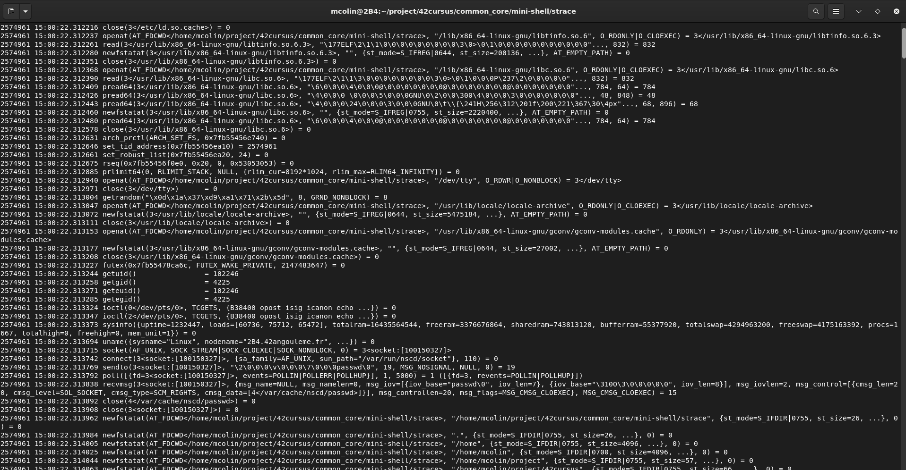

## Pipeline
<details>
<summary>evolution of the parsing pipeline</summary>
<div style="padding-left: 30px;">
<details>
<summary>The firts pipline</summary>

<h3>context struct:</h3>

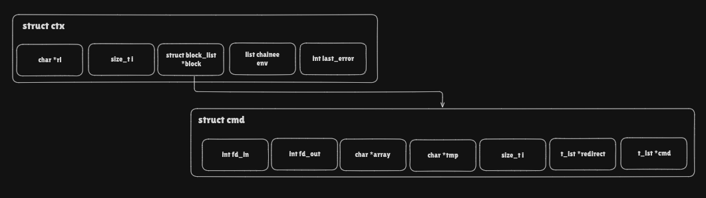

<h3>syntax error:</h3>

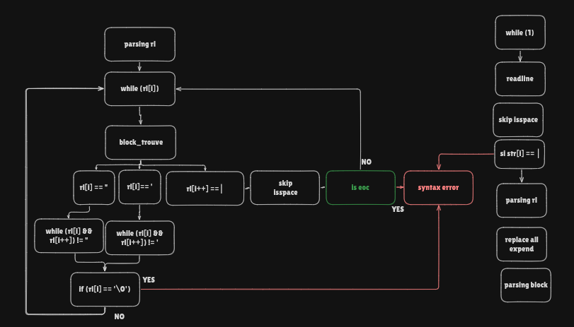

<h3>parse commands:</h3>

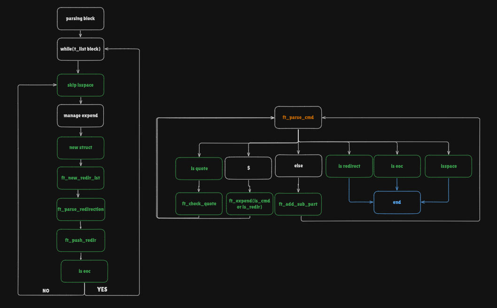

</details>
<details>
<summary>The final pipline</summary>

<h3>context struct:</h3>

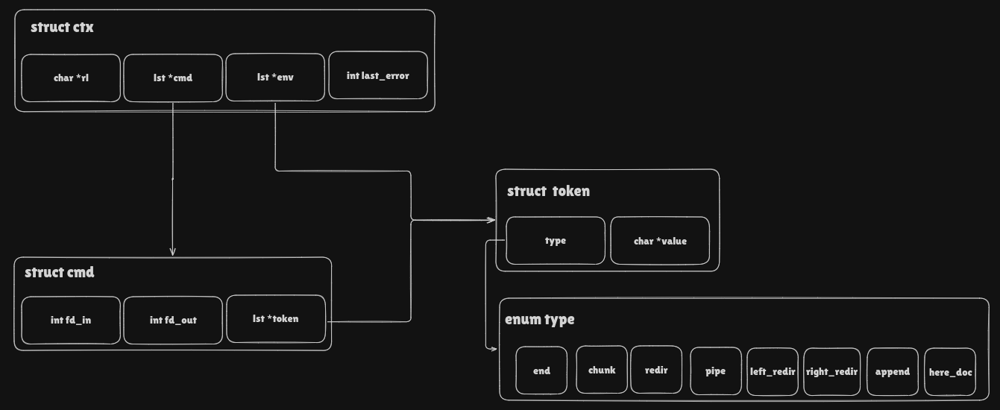

<h3>syntax error:</h3>

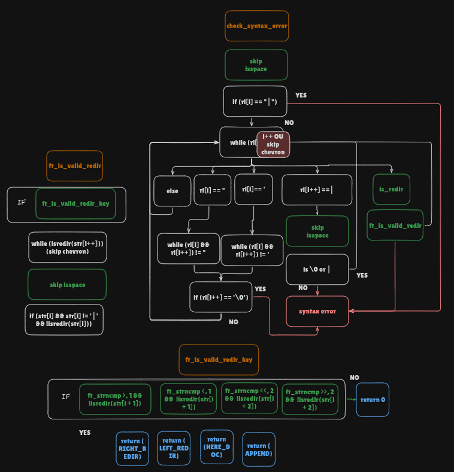

<h3>parse readline:</h3>

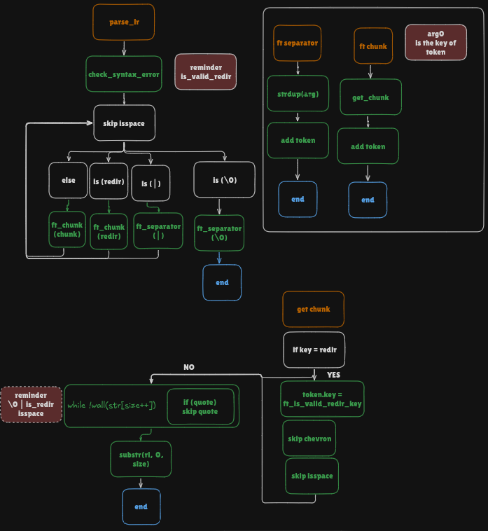

<h3>parse cmd:</h3>

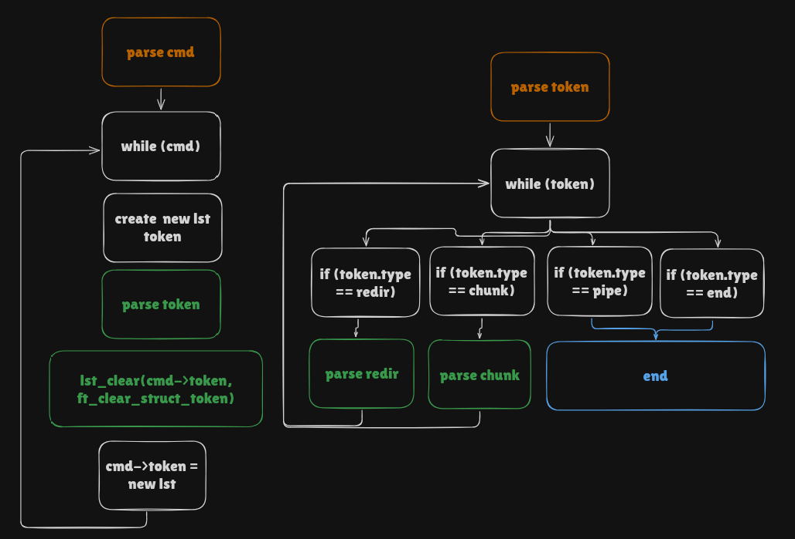

<h3>parse redir:</h3>

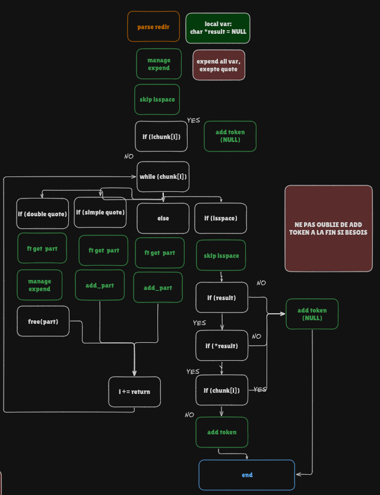

</details>
</div>
</details>

<details>
<summary>execution</summary>

### Pipeline execution

<h3>this is the global structure of the execution.</h3>

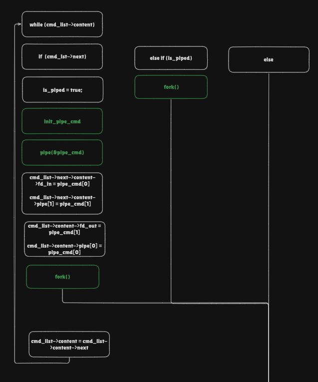

<h3>execution management:</h3>

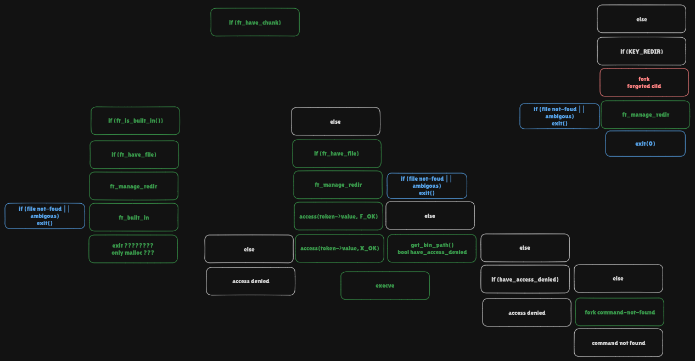

</details>

## conclusion

This project has taught us so much !!!<br>
We never imagined we could take a project this far before.